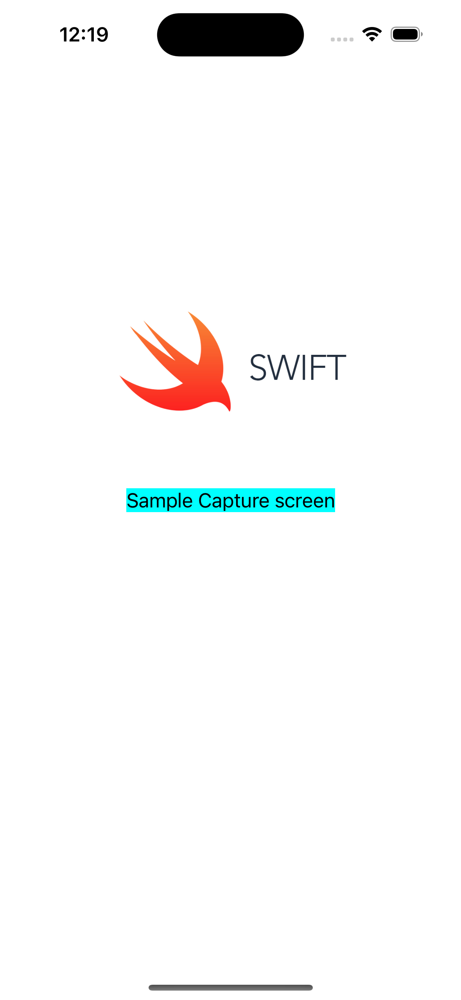
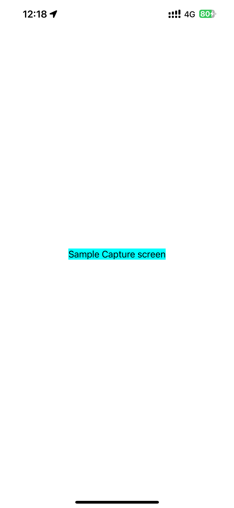
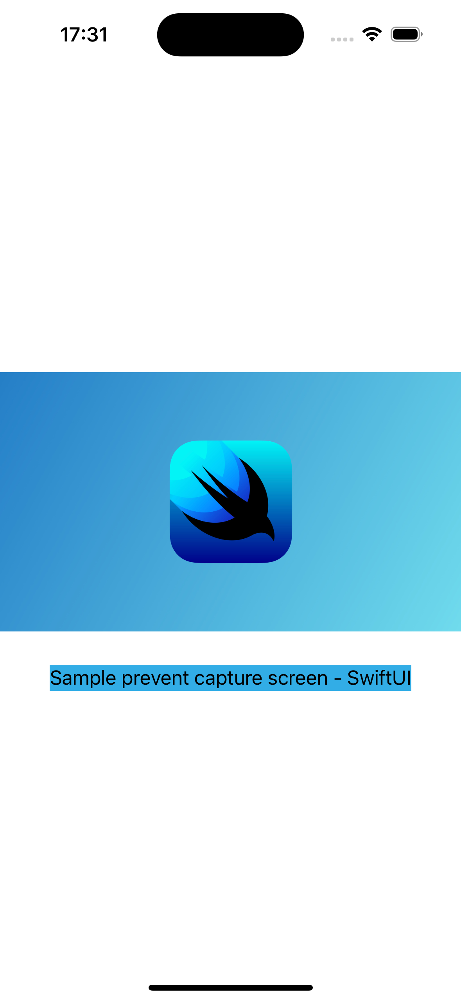
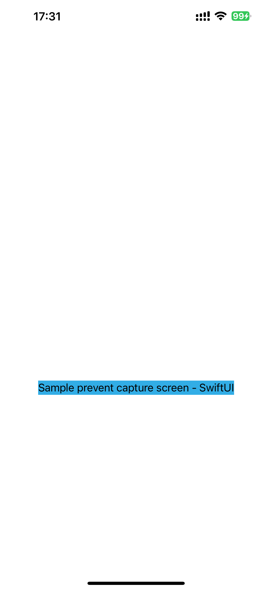

Trước đây thì khi có yêu cầu về việc ngăn chặn người dùng Screenshot hoặc ScreenRecording cho ứng dụng iOS thì tôi luôn trả lời rằng "Không làm được" và "Việc này không có ý nghĩa gì", lý do là vì người dùng có thể dùng 1 chiếc điện thoại khác và chụp lại màn hình mà không thể có thế lực siêu nhiên nào có thể cản được.

Tuy nhiên, trong một vài trường hợp thì việc ngăn chặn user chụp màn hình có thể khá là có ý nghĩa, ví dụ như:

- Ứng dụng chỉnh sửa ảnh, cho chỉnh sửa nhưng không cho xuất ảnh nếu người dùng chưa "nạp VIP"
- Ứng dụng chiếu phim, dạy học online như Netflix, Udemy

Cho nên, việc ngăn chặn người dùng có thể "screenshot/recording" màn hình ứng dụng vẫn sẽ có ý nghĩa nhất định.

Do đó, dưới đây là phương pháp ngăn chặn capture màn hình cho từng phiên bản UIKit và SwiftUI
> Note: Trên simulator sẽ không hoạt động, hãy dùng device thật
> Thậm chí, dùng Quick time recording device screen thì cũng không thể record được

1. UIKit, screen capture prevention

Tạo Extension cho View như dưới:

```swift
extension UIView {
    func preventScreenCapture() {
        DispatchQueue.main.async {
            let field = UITextField()
            field.isSecureTextEntry = true
            field.isUserInteractionEnabled = false
            self.addSubview(field)
            field.centerYAnchor.constraint(equalTo: self.centerYAnchor).isActive = true
            field.centerXAnchor.constraint(equalTo: self.centerXAnchor).isActive = true
            self.layer.superlayer?.addSublayer(field.layer)
            // Trong trường hợp `last` không hoạt động, thì thử luôn với `first`
            // field.layer.sublayers?.first?.addSublayer(self.layer)            
            field.layer.sublayers?.last?.addSublayer(self.layer)
        }
    }
}
```

Cách dùng:

```swift
override func viewDidLoad() {
        super.viewDidLoad()
        label.backgroundColor = .gray
        imageView.preventScreenCapture()
    }
```

Kết quả:

| Design màn hình             |  Ảnh chụp màn hình |
:-------------------------:|:-------------------------:
 | 

> Note: Ảnh chụp design được chụp trên simulator, cách làm này sẽ không hoạt động trên simulator, nên muốn test thì hãy dùng device thật

2. SwiftUI, screen capture prevention

Trước khi bước vào làm với SwiftUI, thì chúng ta cùng đặt câu hỏi, tại sao dùng `UITextField` với thuộc tính `isSecureTextEntry = true` thì có thể chặn được việc record screen?

Trong docs của Apple có viết [iSSecureTextEntry là "A Boolean value that indicates whether a text object disables copying, and in some cases, prevents recording/broadcasting and also hides the text."](https://developer.apple.com/documentation/uikit/uitextinputtraits/1624427-issecuretextentry).

Như vậy, với trường hợp view là text field secure text entry thì sẽ được chặn việc record và broadcasting (bởi iOS). Do đó, khi tạo 1 view là secure TextField và đè lên view cần "chặn capture", thì sẽ chặn được screen capture.

Vậy, sang SwiftUI, ta có thể làm tương tự. Tức là dùng 1 cái ZStack, đè [SecureField](https://developer.apple.com/documentation/swiftui/securefield) lên trên view mà muốn chặn capture.

Tôi đã thử 1 vài cách theo hướng này, nhưng không thành công. Theo tôi thì có thể do bản chất SwiftUI và UIKit khác nhau về bản chất (declarative vs imperative), nên phương thức hoạt động khác nhau dẫn đến kết quả không như mong đợi.

Do đó, phương hướng sẽ là, tạo 1 cái view UITextField với isSecureTextEntry true và đè lên SwiftUI view, sử dụng Hosting View Controller hoặc UIViewRepresentable.

Đương nhiên với vài cú search đơn giản thì kết quả đã có. Phương hướng là dùng UIViewRepresentable.

Cách làm:

Tạo Struct View `UIViewRepresentable` có UITextField và content view của View muốn "prevent capture"

```swift
public struct ScreenshotPreventView<Content: View>: UIViewRepresentable {
    let content: Content
    public init(@ViewBuilder content: @escaping () -> Content) {
        self.content = content()
    }

    public func makeUIView(context: Context) -> UIView {
        let secureTextField = UITextField()
        secureTextField.isSecureTextEntry = true
        secureTextField.isUserInteractionEnabled = false

        guard let secureView = secureTextField.layer.sublayers?.first?.delegate as? UIView else {
            return UIView()
        }

        secureView.subviews.forEach { subview in
            subview.removeFromSuperview()
        }

        let hostingView = UIHostingController(rootView: content)
        hostingView.view.backgroundColor = .clear
        hostingView.view.translatesAutoresizingMaskIntoConstraints = false

        secureView.addSubview(hostingView.view)
        NSLayoutConstraint.activate([
            hostingView.view.topAnchor.constraint(equalTo: secureView.topAnchor),
            hostingView.view.bottomAnchor.constraint(equalTo: secureView.bottomAnchor),
            hostingView.view.leadingAnchor.constraint(equalTo: secureView.leadingAnchor),
            hostingView.view.trailingAnchor.constraint(equalTo: secureView.trailingAnchor)
        ])

        return secureView
    }

    public func updateUIView(_ uiView: UIView, context: Context) { }
}
```

Tiếp theo, tạo View extension

```swift
extension View {
    @ViewBuilder func preventCaptureScreen() -> some View {
        ScreenshotPreventView { self }
    }
}
```

Sử dụng

```swift
    VStack(spacing: 0) {
        Image(.imageSwiftUI)
            .resizable()
            .aspectRatio(contentMode: .fit)
            .preventCaptureScreen()

        Text("Sample prevent capture screen - SwiftUI")
            .background(.cyan)
    }
    .frame(maxHeight: 300)
```

Như vậy là đã chặn được screen capture cho phần Image, còn Text thì vẫn capture bình thường

| Design màn hình (SwiftUI) | Ảnh chụp màn hình (SwiftUI) |
:-------------------------:|:-------------------------:
 | 

Mặc dù theo tôi, tính ứng dụng của việc chặn "screen capture" là không lớn, nhưng biết còn hơn không.
Từ giờ, nếu khách hàng muốn chặn screen capture, tôi sẽ mạnh dạn say "YES"
