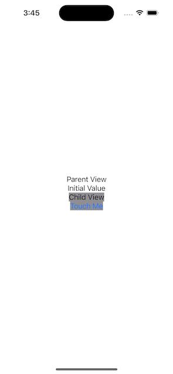
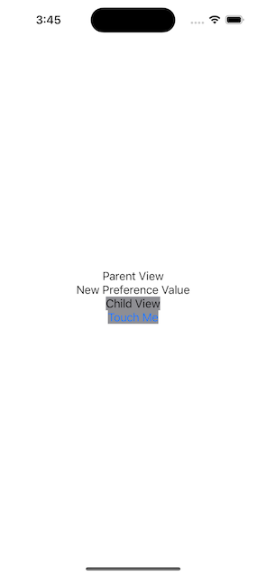

Trong SwiftUI thì có sử dụng khái niệm **single *source of truth***

## Table of contents
{: .no_toc }

1. TOC
{:toc}

## Managing user interface

Trong trường hợp cần sử dụng data trong nội bộ của View, thường là data dùng để hiển thị lên View hoặc trong các View có mối liên hệ với nhau, thì sử dụng State, StateObject hoặc Binding (gọi là Property Wrapper).

Những property được mark với các property wrapper trên thì về cơ bản là vòng đời của property sẽ gắn liền với vòng đời của View (hoặc Scene, App) mà nó được khai báo. Nên vòng đời của property sẽ tương ứng với vòng đời của View.

Chú ý, với những data có thể thay đổi thì mới define dưới dạng state, còn với những data chỉ hiển thị thì có thể define với `let`

Trong trường hợp muốn share data hoặc state từ View sang child view thì có thể sử dụng @Binding ở child view.

Ví dụ:

```swift
struct PlayButton: View {
  @Binding var isPlaying: Bool

  var body: some View {
    Button(action: {
      self.isPlaying.toggle()
    }) {
      Image(systemName: isPlaying ? "pause.circle" : "play.circle")
    }
  }
}
```

`PlayButton` là view mà sẽ thay đổi dựa vào property là `isPlaying`. Ở đây thì `PlayButton` không quản lý trạng thái của `isPlaying` mà sẽ phụ thuộc vào parent view.

```swift
struct PlayerView: View {
  ...    
  @State private var isPlaying: Bool = false
  
  var body: some View {      
      VStack {
        ...
        PlayButton(isPlaying: $isPlaying)
      }
  }
}
```

Như vậy, trạng thái của `PlayButton` sẽ phụ thuộc vào State variable `isPlaying` của `PlayerView`. Khi user toggle trạng thái của `PlayButton` thì thực tế là đang thay đổi giá trị `isPlaying` của `PlayerView`

## Managing model data in app

Với UIKit thì việc tạo 1 property để hold data cho màn hình là việc rất bình thường, data property này có thể là một array chứa data, 1 object của Model class, hoặc 1 object của Services class...

Tuy nhiên với SwiftUI thì mọi view của nó đều là struct, và mỗi khi view redraw thì các property khai báo trong view sẽ được reset về giá trị ban đầu, do đó việc hold data cho view trong SwiftUI không thể sử dụng cách khai báo như với UIKit.

Vì vậy, trong SwiftUI chúng ta sử dụng các property wrapper như là `@State`, `@StateObject`, `@Binding`, `@ObservedObject` để khai báo property sử dụng trên view. Khi property data thay đổi thì SwiftUI sẽ tự động vẽ lại view. Tuy nhiên việc sử dụng property wrapper như nào cho đúng thì cần phải nắm được bản chất thì dùng mới chính xác.

Với `@State` và `@Binding` thì đã được mô tả trong section [Managing user interface](#managing-user-interface)

`@StateObject` và `@ObservedObject` về cơ bản thì cách dùng khá giống với `@State` và `@Binding`. Tuy nhiên khác nhau ở chỗ là `@State` và `@Binding` là dùng cho value type trong khi `@StateObject` và `@ObservedObject` dùng cho reference type.

Sử dụng `@StateObject` để define các data model thuộc view, với những property define với `@StateObject` thì sẽ được keep value khi view redraw.

Nhắc lại, `@StateObject` chỉ sử dụng để define data model cho view. Trong trường hợp data được chia sẻ ở nhiều view khác nhau, như được khởi tạo tại một view và các view khác sử dụng dưới dạng reference thì dùng `@ObservedObject`.

`@ObservedObject` dùng để khai báo data model cho view mà bản thân view không quản lý, mà được reference từ view khác. Ví dụ data model được khai báo ở parent view và được share sang child view thì sử dụng `@ObservedObject`. Việc phân biệt mục đích và cách sử dụng `@StateObject`, `@ObservedObject` cần phải được nắm rõ vì nó khác nhau và có thể tiềm ẩn bug.

Ví dụ chúng ta có 2 view là `ParentView` và `ChildView`, với `ChildView` là view con của `ParentView`. Trong trường hợp `ChildView` khai báo property sử dụng `@ObservedObject` thì khi `ParentView` redraw, giá trị property của `ChildView` cũng sẽ bị reset, mặc dù property của `ChildView` không hề liên quan đến `ParentView` Trong trường hợp này, thì cần sử dụng `@StateObject`, khi đó cho dù `ParentView` có reload thì cũng không ảnh hưởng gì đến giá trị property của `ChildView`.

> Bổ sung sample source cho ví dụ này.

**Share an object throughout app**  
Khi muốn share data xuyên suốt app, hoặc loại data mà có thể sử dụng ở nhiều màn hình, tuy nhiên các màn hình đấy không liên tục nhau, dẫn đến việc transfer data giữa các màn hình trở nên khó khăn (ví dụ data dùng ở màn hình A, D, trong khi flow màn hình là A -> B -> C -> D thì việc transfer data qua 2 màn hình không liên quan là B, C trở nên bất hợp lý) thì có thể cân nhắc việc sử dụng `@EnvironmentObject`.

Có thể suy nghĩ đến các trường hợp như Application State (dùng để quản lý trạng thái của app, các stack của flow màn hình) hoặc User State để lưu trữ data trạng thái của User, config của User, thì có thể sử dụng `@EnvironmentObject`.

Cách sử dụng:

Với data model sử dụng để làm Environment Object thì chỉ cần conform to protocol `ObservableObject`.

```swift
final class UserState: ObservableObject {
    @Published var loginState: UserLoginState = .notLoggedIn

    static let shared = UserState()

    private init() { }
}
```

Còn khi sử dụng thì có thể khai báo dạng:

```swift
struct HomeView: View {
    @EnvironmentObject var userState: UserState
    ...
}
```

Thông thường thì Environment Object được add vào app tại `App` hoặc tại main `View`
Ví dụ:

```swift
struct SwiftUIApp: App {
    let userState = UserState.shared

    var body: some Scene {
        WindowGroup {
            ContentView().environmentObject(userState)
        }
    }
}
```

hoặc

```swift
struct ContentView: View {
    let userState = UserState.shared
    
    var body: some View {
        MainView().environmentObject(userState)
    }
}
```

Có một vài lưu ý khi dùng Environment Object như sau

- Về cơ bản thì vòng đời của environment object khá là dài, và nó sẽ consume data liên tục trong suốt vòng đời của app, nên việc sử dụng nó sẽ tăng memory -> không lạm dụng environment object khi không thực sự cần thiết
- Environment Object được dùng ở toàn app hoặc trong một phạm vi khá lớn, dẫn đến việc rất dễ xảy ra sai sót logic do nhiều màn hình cùng sử dụng chung một data. Vì vậy khi dùng Environment Object cần phải review kỹ logic tránh sai sót.
- Environment Object nếu chưa được inject vào app thông qua modifier environmentObject() thì nếu sử dụng app sẽ bị crash.

## Environment values

`Environment` property wrapper dùng để đọc các giá trị của view, thuộc các group như `Accessibility`, `Actions`, `Authentication`, `Controls and input`, `Display characteristics`, `Global objects`, `Scrolling`, `State`, `StoreKit configuration`, `Text styles`, `View attributes`, `Widgets`. Các giá trị này cung cấp thông tin về config của view hoặc của app, thông qua đó có thử xử lý UI hay logic một cách phù hợp.

Sử dụng `Environment` để đọc các thông tin như Core Data managed object, color scheme, light mode / dark mode, calendar, locale, time zone, trạng thái edit của view, text styles...

Syntax:

```swift
@Environment(\.colorScheme) var colorScheme: ColorScheme

if colorScheme == .dark { // Checks the wrapped value.
    DarkContent()
} else {
    LightContent()
}
```

Nếu value thay đổi `colorScheme` thì các phần view liên quan đến `colorScheme` sẽ được update.  
Các `Environment` property thường là read-only với value được set bởi SwiftUI, đối với những `Environtment` property mà có thể thay đổi được thì có thể sử view modifier [`environment(_:_:)`](https://developer.apple.com/documentation/swiftui/view/environment(_:_:))

Có thể tham khảo danh sách Environment Values đầy đủ tại [EnvironmentValues](https://developer.apple.com/documentation/swiftui/environmentvalues).

Một vài điểm lưu ý:

- SwiftUI sẽ tự động tạo Environment cho View, và apply các Environment setting cho tất cả child view tự động.
- Child view có thể override lại environment setting thông qua environment modifier `environment`.

## Preferences

`Preferences` là phương pháp truyền data từ child view lên parens view hoặc view cấp cao hơn mà không cần gửi data qua từng view trung gian (tương tự Environment là từ trên xuống, còn Preferences là từ dưới lên).

Child view sẽ lưu các thông tin sử dụng preference key, data này có thể được lấy ra bởi các parent views, hoặc view cấp cao hơn thông qua preference key. Các thông tin có thể sử dụng Preferences để gửi nhận như thông tin về layout, thông tin về kích thước view, các data đơn giản như string title.

Để sử dụng Preferences thì cần define các preference key mà conform đến protocol `PreferenceKey`. PreferenceKey protocol sẽ define cách mà data kết hợp với nhau khi mà có nhiều views gửi data với key giống nhau.

Để set preference value ở child view thì sử dụng preference modifier. Preference value là kiểu data mà phải conform đến protocol `Equatable`. Trong view cấp trên thì sử dụng `onPreferenceChange` modifier để lắng nghe sự thay đổi của preference value và update view tương ứng.

Sample source

Đầu tiên, để Preferences có thể hoạt động thì cần phải có Preference Key implementation

```swift
struct ChildViewDataKey: PreferenceKey {
    static var defaultValue: String = ""

    static func reduce(value: inout String, nextValue: () -> String) {
        value = nextValue()
    }
}
```

Ở ví dụ này thì preference key xử lý logic khi có nhiều preference được bắn từ view con thì view cấp trên sẽ lấy value mới nhất. Ngoài ra có thể xử lý logic phức tạp hơn tùy thuộc vào nhu cầu bài toán.

Parent View

```swift
struct MyParentView: View {
    @State var myPreferenceValue: String = ""

    var body: some View {
        VStack {
            Text("Parent View")
            Text(myPreferenceValue)
            MyChildView().background(Color.gray)
        }.onPreferenceChange(ChildViewDataKey.self) { value in
            myPreferenceValue = value
        }
    }
}
```

Child View

```swift
struct MyChildView: View {
    @State var myPreferenceValue = "Initial Value"

    var body: some View {
        Text("Child View")
        Button("Touch Me") {
            myPreferenceValue = "New Preference Value"
        }.preference(key: ChildViewDataKey.self, value: myPreferenceValue)
    }
}
```

Trong ví dụ này, khi user tap button `Touch Me` thì preference value sẽ thay đổi, khi đó child view sẽ gửi preference value đi và parent view sẽ nhận được, sau đó update lên UI.

Result:

 

## Persistent storage

SwiftUI cung cấp một vài property wrapper để view có thể lưu trữ data như `@AppStorage`, `@SceneStorage` và `@FetchRequest` của Core Data.

**@AppStorage**  
`@AppStorage` là property cho phép view lưu và ghi dữ liệu trực tiếp vào UserDefauls. Khi value của key tương ứng thay đổi trong UserDefaults thì UI sẽ được refresh, ngược lại khi data trên view thay đổi thì data đó sẽ được sync xuống UserDefaults ngay lập tức.

Vì `@AppStorage` bản chất là được lưu ở User Default standard (`UserDefaults.standard`), nên chúng ta cần hiểu rằng data được lưu bởi property wrapper này sẽ không được bảo mật, ngoài ra thì việc trùng key với các phần lưu User Default trong  logic của app là có thể xảy ra, nên cần lưu ý khi đặt tên cho key.

Source sample:

```swift
struct ContentView: View {
    @AppStorage("HomeScreenUserName") var username: String = "nhathm"

    ...
}
```

Trong một vài trường hợp, có thể sử dụng group user default khác để lưu data cho view.

```swift
    @AppStorage("HomeScreenUserName", store: UserDefaults(suiteName: "group.com.nhathm.sample")) var username: String = "nhathm"
```

> Note: suiteName cho phép app chia sẻ content giữa các apps với nhau hoặc với extensions mà có chung App Group. Phân biệt bởi suite name.

Về cơ bản thì data được lưu trong user default nên khi quit app bật lại thì data vẫn được lưu trữ. Và các kiểu data có thể lưu trữ khá cơ bản, cần phải có thể encode và decode được.

**@SceneStorage**  
Scene Storage là  property wrapper dùng để lưu trữ các dạng lightweight data, nhằm mục đích restore lại data trên app khi app bị quit vì lý do nào đó.

Ví dụ dùng để lưu trữ data user đang nhập liệu trong màn hình: nhập thông tin / gửi request / note...mà có cuộc gọi đến, hoặc user switch sang chơi game, thì có thể app sẽ bị suspended, hoặc app bị crash. Lúc này nếu sử dụng Scene Storage thì khi bật lại app, có thể restore lại data mà user đang nhập.

Lưu ý rằng nếu user quit app thông qua multi tasking thì data lưu trong Scene Storage cũng sẽ bị xóa.

Sample source:

```swift
struct NoteView: View {
    @SceneStorage("NoteView.todayNote") var text = ""

    var body: some View {
        TextEditor(text: $text)
    }
}
```

Không được lưu trữ data phức tạp, chỉ lưu trữ data cho mục đích restoration
Data quan trọng cũng không được lưu trong Scene Storage
Nếu app có nhiều Scene (app iPad, macOS) thì data của từng Scene sẽ khác nhau
Trong trường hợp muốn lưu trữ custom type data thì cần phải implement để struct đó có thể Codeable được, encode và decode data sử dụng JSONEncoder/JSONDecoder và conform to `RawRepresentable` protocol
Sample: <https://useyourloaf.com/blog/scenestorage-for-custom-types/>

**CoreData**  
SwiftUI cũng hỗ trợ View access thẳng xuống Core Data để lưu và nhận data.
Tuy nhiên, với quan điểm cá nhân thì view nên tách biệt khỏi các loại data cần setup như core data để đảm bảo việc tái sử dụng view một cách dễ dàng, nên Core data sẽ không được đề cập trong bài viết này.

Với các dạng màn hình cần lưu trữ data dạng cache như search result thì thay vì sử dụng core data, hãy sử dụng view model.
