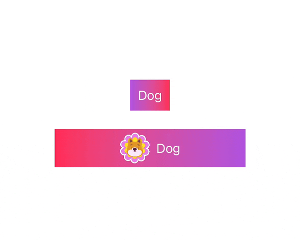

## Table of contents  
{: .no_toc }

1. TOC
{:toc}

Sample Multi State Button

||

Button thay đổi trạng thái theo list đã cho trước.

Source code:

```swift
import SwiftUI

protocol ButtonState: CaseIterable, Equatable {
    var title: String { get }
    var iconName: String { get }
}

/**
* Create default value for button title
*/
extension ButtonState where Self: RawRepresentable, RawValue == String {
    var title: String {
        self.rawValue
    }
}

/**
 * ** Create multi state button with your custom state **
 * ** Define custom state enum conform protocol `ButtonState`
 */
struct MultiStateButton<T: ButtonState>: View {
    let buttonState: [T]
    @Binding var selectedState: T
    @State private var currentIndex: Int
    
    let action: () -> Void
    
    init(buttonState: [T], selectedState: Binding<T>, action: @escaping () -> Void) {
        self.buttonState = buttonState
        self._selectedState = selectedState
        
        let currentIndex = buttonState.firstIndex(where: { $0 == selectedState.wrappedValue } ) ?? 0
        
        self._currentIndex = State(initialValue: currentIndex)
        self.action = action
    }
    
    var body: some View {
        Button {
            currentIndex = currentIndex + 1 < buttonState.count ? currentIndex + 1 : 0
            selectedState = buttonState[currentIndex]
            action()
        } label: {
            HStack {
                Image(buttonState[currentIndex].iconName)
                    .resizable()
                    .scaledToFit()
                    .frame(maxHeight: 40)
                Text(buttonState[currentIndex].title)
            }
            .frame(maxWidth: 250, maxHeight: 50)
            .foregroundColor(.white)
            .background(LinearGradient(gradient: Gradient(colors: [.pink, .purple]), startPoint: .leading, endPoint: .trailing))
            .padding()
        }
    }
}
```

Để sử dụng Multi State Button, define Enum các trạng thái mong muốn như dưới:

```swift
enum CustomButtonState: String, ButtonState {
    case adoptDog = "Adopt Dog"
    case dog = "Dog"
    case dogWoof = "Dog Woof"
    case rabbit = "Rabbit"
    case catPaw = "Cat Paw"
    
    var iconName: String {
        switch self {
        case .adoptDog:
            return "adopt-dog"
        case .dog:
            return "dog"
        case .dogWoof:
            return "dog-woof"
        case .rabbit:
            return "rabbit"
        case .catPaw:
             return "cat-paw"
        }
    }
}
```

Sử dụng:

```swift
struct MainView: View {
    @State var buttonState: CustomButtonState = .dogWoof
    
    var body: some View {
        Group {
            Text(buttonState.title)
                .buttonStyle(GradientButton())
            
            MultiStateButton(buttonState: CustomButtonState.allCases, selectedState: $buttonState, action: {
                print("button selected")
                print("button state \(buttonState)")
            })
        }
    }
}
```
